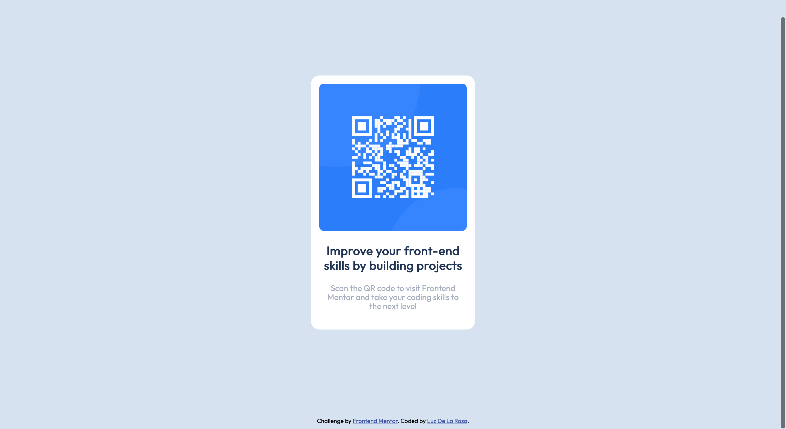

# Frontend Mentor - QR code Solution using CSS Flexbox

## Welcome! 👋

## Table of contents
- [Overview](#overview)
  - [challenge](#challenge)
  - [Links](#links)
- [My process](#my-process)
  - [Built with](#built-with)
- [Author](#author)

## Overview

This my solution to the [QR code component challenge on Frontend Mentor](https://www.frontendmentor.io/challenges/qr-code-component-iux_sIO_H). Frontend Mentor challenges help you improve your coding skills by building realistic projects. 
## The challenge

The challenge is to build out this QR code component and get it looking as close to the design as possible.

### Links

- Solution URL: [https://github.com/luztherose/qr-code-solution-using-css-flexbox](https://github.com/luztherose/qr-code-solution-using-css-flexbox)
- Live Site URL: [https://luztherose.github.io/qr-code-solution-using-css-flexbox/](https://luztherose.github.io/qr-code-solution-using-css-flexbox/)

## My process
### Built with

- Semantic HTML5 markup
- CSS custom properties
- Flexbox
- Fully responsive 

## Author

- Website - [Luz De La Rosa](https://luztherose.github.io/portfolio/)
- Frontend Mentor - [@luztherose](https://www.frontendmentor.io/profile/luztherose)
- Twitter - [@luztherose](https://twitter.com/luztherose)

**Having fun building!** 🚀
